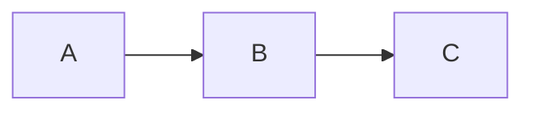
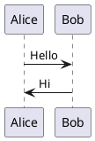

# Slidev Syntax Reference

Comprehensive reference for Slidev markdown syntax, layouts, animations, and advanced features.

## Slide Structure

### Separators

- Slides are separated by `---` on its own line
- First slide starts at the top of the file (no leading separator needed)
- The `---` separator also doubles as frontmatter delimiters for per-slide config

### Headmatter

Global configuration block at the very top of `slides.md`, delimited by `---`:

- `theme` — Slidev theme package name (e.g., `default`, `seriph`, `apple-basic`)
- `title` — presentation title, used in browser tab and OG metadata
- `info` — markdown string shown in the presenter view info panel
- `drawings` — configure drawing overlay (`persist: false` to disable saving)
- `transition` — default slide transition (e.g., `slide-left`, `fade`, `none`)
- `mdc` — enable MDC (Markdown Components) syntax (`true`/`false`)
- `fonts` — configure web fonts (`sans`, `serif`, `mono`, `provider`)
- `defaults` — default frontmatter values applied to all slides

Example:

```yaml
---
theme: seriph
title: My Talk
transition: slide-left
mdc: true
---
```

### Per-slide Frontmatter

Placed between `---` separators at the start of a slide:

- `layout` — slide layout (see Layouts section)
- `class` — additional CSS classes on the slide container
- `background` — background image URL or color
- `transition` — override transition for this slide
- `clicks` — custom total click count for the slide
- `hideInToc` — exclude slide from table of contents (`true`/`false`)

Example:

```markdown
---
layout: cover
background: /images/hero.jpg
class: text-center
---

# Welcome
```

## Layouts

Built-in layouts and their purpose:

- `default` — standard content slide, no special styling
- `cover` — title/cover slide with centered content, typically first slide
- `center` — vertically and horizontally centered content
- `two-cols` — two-column layout using named slots
- `image` — full-slide background image
- `image-right` — content on left, image on right (set `image` in frontmatter)
- `image-left` — image on left, content on right (set `image` in frontmatter)
- `section` — section divider slide, large centered heading
- `statement` — bold statement slide, centered emphasis
- `fact` — highlight a key fact or number
- `quote` — blockquote-styled slide
- `full` — full-bleed content, no padding
- `iframe-left` — iframe on left, content on right (set `url` in frontmatter)
- `iframe-right` — content on left, iframe on right (set `url` in frontmatter)
- `end` — final slide, typically "Thank you"

### Two-column Slot Syntax

Use named slots to split content in `two-cols` layout:

```markdown
---
layout: two-cols
---

# Left Column

Content on the left side.

::right::

# Right Column

Content on the right side.
```

- `::default::` — explicit left column slot (optional, content before `::right::` is default)
- `::right::` — right column slot

## Code Blocks

- Language tag after opening fence for syntax highlighting: ` ```ts `
- Line highlighting with curly braces: ` ```ts {1,3-5} ` — highlights lines 1, 3, 4, 5
- Enable line numbers: ` ```ts {lines:true} `
- Max height with scrolling: ` ```ts {maxHeight:'200px'} `
- Monaco editor (live editable): ` ```ts {monaco} `
- Monaco as diff editor: ` ```ts {monaco-diff} `
- Combined options: ` ```ts {1,3|5-7}{lines:true,maxHeight:'200px'} `
- Click-based progressive highlighting: ` ```ts {1|3-5|7} ` — first click highlights line 1, second highlights 3-5, third highlights 7

## Presenter Notes

Add notes visible only in presenter view using an HTML comment block below slide content:

```markdown
# My Slide

Slide content here.

<!--
These are presenter notes.
They appear in the presenter view but not on the projected slide.
- Supports markdown formatting
- Use for talking points and reminders
-->
```

- Place the comment block at the end of each slide's content
- Presenter notes require `<!-- -->` HTML comment syntax -- other comment styles are not recognized by Slidev
- Content inside supports markdown formatting

## Click Animations

Reveal content progressively with click-triggered animations:

- `v-click` — wrap element to show on next click

  ```html
  <v-click>

  - This appears on click

  </v-click>
  ```

- `v-after` — show with the same click as the previous `v-click`

  ```html
  <v-click>

  - First item (click 1)

  </v-click>
  <v-after>

  - Also appears on click 1

  </v-after>
  ```

- `v-clicks` — each direct child becomes a click step

  ```html
  <v-clicks>

  - Step 1
  - Step 2
  - Step 3

  </v-clicks>
  ```

- `v-click` with depth: `<v-clicks depth="2">` applies to nested lists
- Custom click order: `<v-click at="3">` — show at click 3

## Rich Content

### LaTeX Math

- Inline math: `$E = mc^2$`
- Block math (centered, own line):

  ```markdown
  $$
  \int_0^\infty f(x)\,dx
  $$
  ```

- Powered by KaTeX

### Mermaid Diagrams

````markdown

````

- Supports flowcharts, sequence diagrams, Gantt charts, and all Mermaid diagram types
- Rendered as SVG in the slide

### PlantUML Diagrams

````markdown

````

- Requires PlantUML server (configured in headmatter or env)

### MDC Syntax

When `mdc: true` is set in headmatter, use component shorthand:

- Inline: `:component-name[content]{attr=value}`
- Block wrapping uses `:::component-name` / `:::`

## Advanced Features

### Importing Slides

Pull slides from other files into the current deck:

```markdown
---
src: ./pages/intro.md
---

---
src: ./pages/demo.md
---
```

- Each `src` entry inserts all slides from the referenced file
- Paths are relative to the main `slides.md`

### Scoped Styles

Add a `<style>` tag at the end of a slide for per-slide CSS:

```markdown
# Styled Slide

Content here.

<style>
h1 {
  color: #2B90B6;
}
</style>
```

- Styles are automatically scoped to the current slide
- Supports full CSS including Windi CSS / UnoCSS utilities

### Custom Vue Components

- Place `.vue` files in `components/` directory at the project root
- Components auto-register and become available in all slides
- Use standard Vue SFC syntax (template, script, style)
- Reference in slides as `<MyComponent />`

### Static Assets

- Place files in `public/` directory at the project root
- Reference with leading `/`: ``
- Available at build time without import
